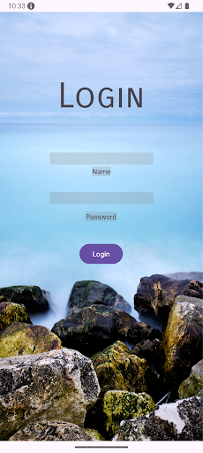
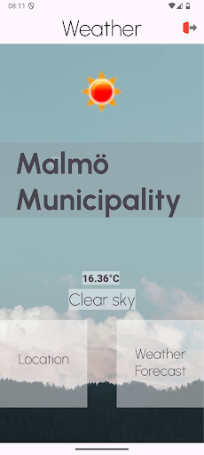
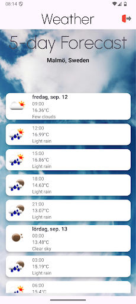
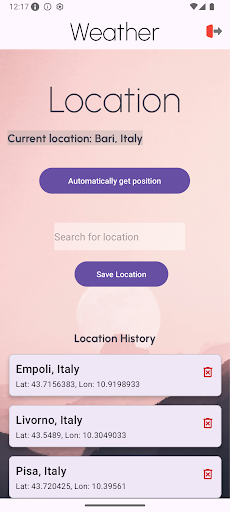
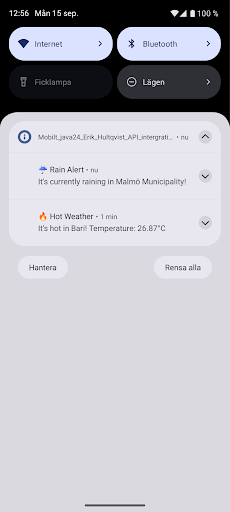

# Mobilt_java24_Erik_Hultqvist_API_intergration_v5

Jag har valt att göra en väderapp, där jag använder två API:er:

- **OpenWeatherMap** – för att få väderdata
- **OpenCageData** – för att hämta platsinformation

## 🔐 Inloggning

För inloggning använder jag **Firebase Authentication**.

## 🌦️ Funktioner

- Notifikationer skickas vid **regn** eller **hetta** (över 25 grader).
- **Databas** för sparade platser (hämtade via GPS eller manuellt sökta).

## 📱 Appstruktur

- `MainActivity` med `FragmentContainerView`
- Fyra Fragments:

1. **Login**

    

2. **Main (Current Weather)**

    

3. **5-Day Forecast**

    

4. **Location (Settings)**

    

## 🧩 Använda API:er

### OpenWeatherMap
- Hämtar aktuell väderdata och prognoser.

### OpenCageData
- Konverterar GPS-koordinater till platsnamn och vice versa.

## 🔔 Notifikationer

- Om vädret visar **regn** skickas en notifikation.
- Om temperaturen är **över 25°C**, skickas en varning om hetta.

## 🗃️ Databas

- Platser sparas i en **lokal databas**.
- Användaren kan välja att spara sin nuvarande plats eller söka efter en plats att lägga till.